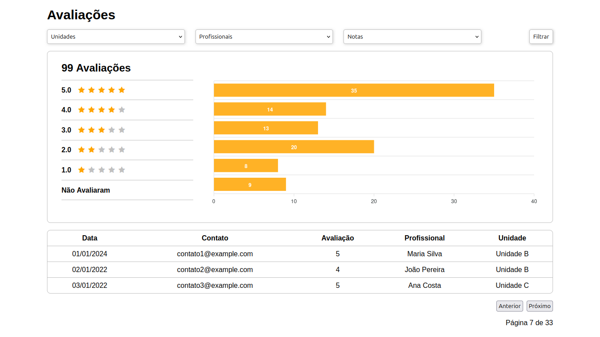

# Sistema de Análise de Avaliações com React

**graphic-review** é uma aplicação web interativa desenvolvida com React que permite visualizar e filtrar avaliações de profissionais e unidades. O projeto demonstra a aplicação de boas práticas e ferramentas modernas do ecossistema React para criar uma interface de usuário dinâmica e performática.

## Tecnologias Utilizadas

- **React**: Biblioteca principal para a construção da interface do usuário.
- **Hooks**: `useState`, `useMemo`, `useCallback` e hooks customizados (`useFilters`) para gerenciar estado, otimizar performance e reutilizar lógica.
- **CSS Modules / Sass**: Para modularizar e estilizar os componentes de forma organizada.
- **ApexCharts.js**: Biblioteca de gráficos para a visualização dos dados.
- **React Icons**: Para ícones modernos e leves.

## Funcionalidades

- **Filtros Dinâmicos**: O usuário pode filtrar as avaliações por unidade, profissional e nota em tempo real.
- **Gráfico Interativo**: Um gráfico de barras exibe a distribuição das notas de acordo com os filtros aplicados, proporcionando uma visão clara dos dados.
- **Paginação Otimizada**: A tabela de comentários no rodapé possui paginação, com o cálculo otimizado através de `useMemo` para evitar re-renderizações desnecessárias.
- **Componentização e Abstração**: O projeto é estruturado em componentes funcionais e utiliza hooks customizados para abstrair a lógica de filtragem, tornando o código limpo e de fácil manutenção.
- **Design Responsivo**: A interface se adapta a diferentes tamanhos de tela, garantindo uma boa experiência tanto em desktops quanto em dispositivos móveis.

## Como Rodar o Projeto

1. Clone o repositório:
   bash
   git clone https://github.com/jonatasem/graphic-review.git
   

2. Navegue até a pasta do projeto:
   bash
   cd graphic-review
   

3. Instale as dependências:
   bash
   npm install
   
   ou
   bash
   yarn install
   

4. Inicie o servidor de desenvolvimento:
   bash
   npm start
   
   ou
   bash
   yarn start
   

O aplicativo estará disponível em http://localhost:5173.

## Contribuições

Sinta-se à vontade para contribuir com este projeto! Se você encontrar um bug ou tiver uma ideia para uma nova funcionalidade, por favor, abra uma issue ou envie um pull request.

## Autor

**Jonatas Elieser Moreira**

- [GitHub](https://github.com/jonatasem)
- [LinkedIn](https://www.linkedin.com/in/jonatasem)

